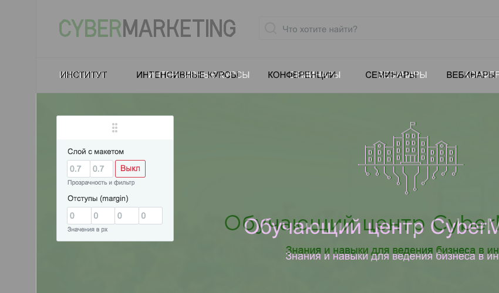

# :page_facing_up: px2px

Проверяем, насколько разметка и стили страницы соответствуют макету, сравнивая наложенный инвертированный макет поверъ вёрстки.



## Как это работает?

К странице подключается JS-файл (безо всяких зависимостей). Он смотрит в html-разметку страницы и если находит блок с классом `px2px` и указанной в `style`-атрибуте проверочной картинкой — сам идёт в картинку, смотрит на её размеры, ставит по центру экана на 100% ширины, инвертирует цвета и включает панель управления.

## Как использовать в своём проекте?

1. Подключить JS-файл на тестируемую страницу:

    ```html
    <script src="https://4enki.github.io/px2px/px2px.min.js"></script>
    ```
1. Cоздать слой для тестирования и указать путь к картинке:

    ```html
    <div class="px2px" style="background-image: url('/_debug/px2px.png');"></div>
    ```
1. Двигать пиксели.

## Зачем?

Разобрался.

## Ещё на эту тему 🔥 🔥 🔥 🔥 🔥

- [Pixel Glass](https://github.com/yoksel/pixel-glass-js) от прекрасной [@yoksel](https://github.com/yoksel)
- [Makeup](https://github.com/2gis/makeup) от ребят из 2Gis *(статья на Хабре: [habrahabr.ru/company/2gis/blog/277457/](https://habrahabr.ru/company/2gis/blog/277457/))*
